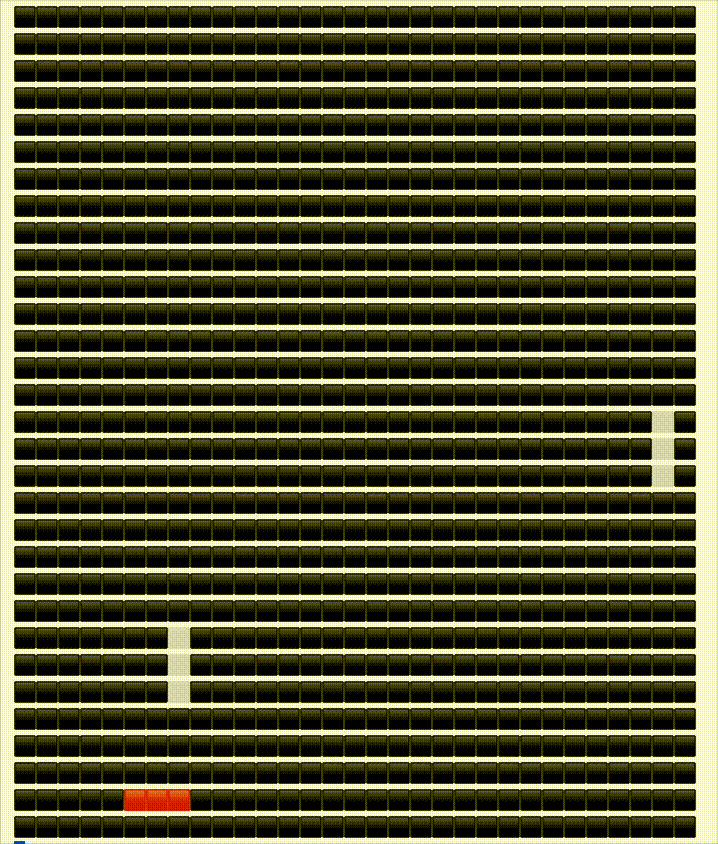
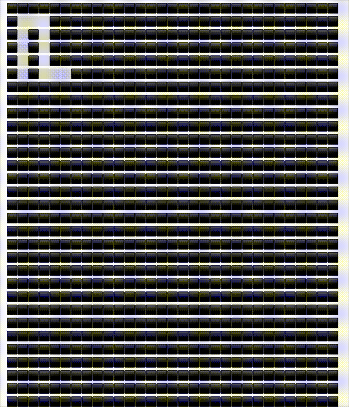
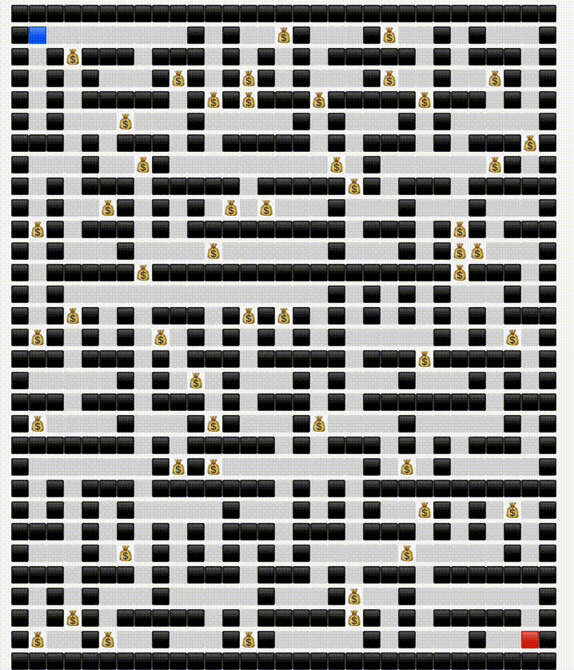
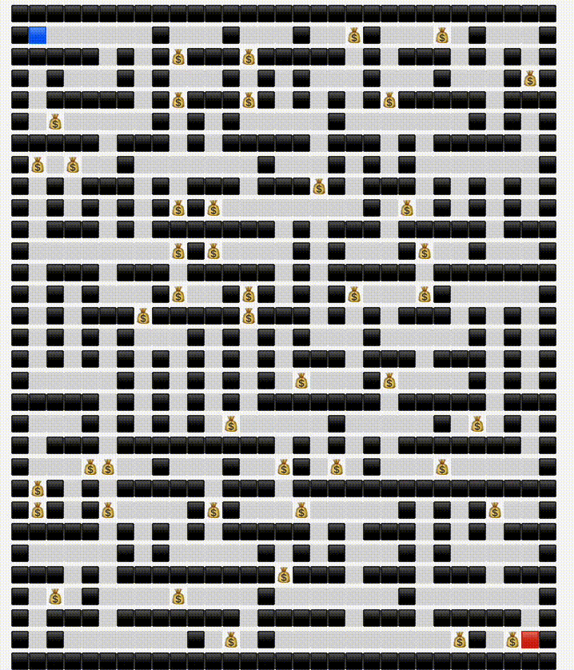
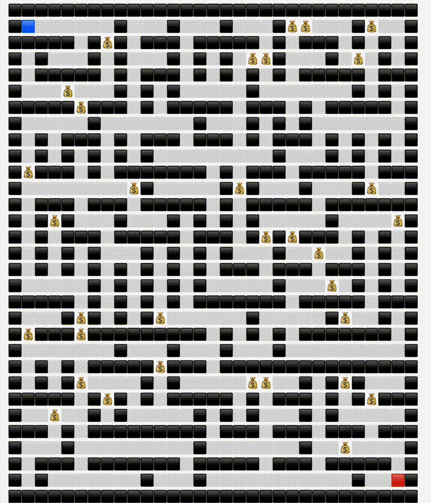

# Шаблон Go-проекта для домашних заданий

Шаблон для домашних заданий [Академии Бэкенда 2024](https://edu.tinkoff.ru/all-activities/courses/870efa9d-7067-4713-97ae-7db256b73eab).

Цель данного репозитория – познакомить вас с процессом разработки приложений на Go с использованием наиболее распространенных практик, инструментов и библиотек.

## Структура проекта

Это шаблон проекта, основанный на лучших практиках структурирования Go кода приложения. Проект содержит в себе следующие компоненты:

- `cmd` – директория, содержащая исполняемые файлы приложения. В данном шаблоне есть только один исполняемый файл `run`, который запускает приложение. Хорошей практикой является название пакета, содержащего `main.go` так же, как и название исполняемого файла. Таким образом в каждом домашнем задании вам будет необходимо изменять название пакета `run` на название, подходящее для вашего приложения.
- `internal` – директория, содержащая внутренние пакеты приложения. Внутренние пакеты не могут быть импортированы другими пакетами вне проекта.
  - `application` - пакет, в котором содержатся юзкейсы приложения.
  - `domain` - пакет, в котором содержатся модели приложения.
  - `infrastructure` - пакет, в котором содержатся инфраструктурные компоненты приложения(работа с выводом пользователю, работа с диском, работа с сетью и т.д.).
- `pkg` – директория, содержащая пакеты, которые могут быть импортированы другими пакетами вне проекта. Общей рекомендацией является то, что пакеты, содержащиеся в `pkg` должны быть независимыми от остальных пакетов проекта. 

 

## Kruskals generate maze
Алгоритм Краскала:   это алгоритм, создающий минимальное связующее дерево. Это интересно, потому что он не «выращивает» лабиринт подобно дереву, а скорее вырезает сегменты проходов по всему лабиринту случайным образом, и тем не менее в результате создаёт в конце идеальный лабиринт. Для его работы требуется объём памяти, пропорциональный размеру лабиринта, а также возможность перечисления каждого ребра или стены между ячейками лабиринта в случайном порядке (обычно для этого создаётся список всех рёбер и перемешивается случайным образом). Помечаем каждую ячейку уникальным идентификатором, а затем обходим все рёбра в случайном порядке. Если ячейки с обеих сторон от каждого ребра имеют разные идентификаторы, то удаляем стену и задаём всем ячейкам с одной стороны тот же идентификатор, что и ячейкам с другой. Если ячейки на обеих сторонах стены уже имеют одинаковый идентификатор, то между ними уже существует какой-то путь, поэтому стену можно оставить, чтобы не создавать петель. Этот алгоритм создаёт лабиринты с низким показателем текучести, но не таким низким, как у алгоритма Прима. Объединение двух множество по обеим сторонам стены будет медленной операцией, если у каждой ячейки есть только номер и они объединяются в цикле. Объединение, а также поиск можно выполнять почти за постоянное время благодаря использованию алгоритма объединения-поиска (union-find algorithm): помещаем каждую ячейку в древовидную структуру, корневым элементом является идентификатор. Объединение выполняется быстро благодаря сращиванию двух деревьев. При правильной реализации этот алгоритм работает достаточно быстро, но медленнее большинства из-за создания списка рёбер и управления множествами. [Ссылка на пост](https://habr.com/ru/articles/445378/)

  

## Prim generate maze
Алгоритм Прима (истинный): этот алгоритм создаёт минимальное связующее дерево, обрабатывая уникально случайные веса рёбер. Объём требуемой памяти пропорционален размеру лабиринта. Начинаем с любой вершины (готовый лабиринт будет одинаковым, с какой бы вершины мы ни начали). Выполняем выбор ребра прохода с наименьшим весом, соединяющим лабиринт к точке, которая ещё в нём не находится, а затем присоединяем её к лабиринту. Создание лабиринта завершается, когда больше не осталось рассматриваемых рёбер. Для эффективного выбора следующего ребра необходима очередь с приоритетом (обычно реализуемая с помощью кучи), хранящая все рёбра границы. Тем не менее, этот алгоритм достаточно медленный, потому что для выбора элементов из обработка кучи требует времени log(n). Поэтому лучше предпочесть алгоритм Краскала, который тоже создаёт минимальное связующее дерево, ведь он быстрее и создаёт лабиринты с идентичной структурой. На самом деле при одинаковом случайном seed алгоритмами Прима и Краскала можно создавать одинаковые лабиринты. [Ссылка на пост](https://habr.com/ru/articles/445378/)

  

## Depth first search solve maze
[Ссылка на статью в википедии.](https://en.wikipedia.org/wiki/Depth-first_search)

  

## Breadth first search solve maze
[Ссылка на статью в википедии.](https://ru.wikipedia.org/wiki/%D0%9F%D0%BE%D0%B8%D1%81%D0%BA_%D0%B2_%D1%88%D0%B8%D1%80%D0%B8%D0%BD%D1%83)

  

## Wall follower solve maze
Следование вдоль стен (Wall follower): это простой алгоритм решения лабиринтов. Приоритетом для него является проходящий лабиринт объект («вы»), он всегда очень быстр и не использует дополнительной памяти. Начинаем идти по проходам и при достижении развилки всегда поворачиваем направо (или всегда налево). Чтобы применить такое решение лабиринта в реальном мире, нужно положить руку на правую (или левую) стену и постоянно держать её на стене в процессе прохождения лабиринта. При желании можно помечать уже посещённые ячейки и ячейки, посещённые дважды. В конце можно вернуться назад по решению, следуя только по ячейкам, посещённым один раз. Этот метод необязательно найдёт кратчайшее решение, и он совершенно не работает, если цель находится в центре лабиринта и его окружает замкнутая цепь, потому что вы будете ходить вокруг центра и со временем придёте к началу. Следование вдоль стены в 3D-лабиринте можно реализовать детерминированным способом, спроецировав 3D-проходы на 2D-плоскость, т.е. притворившись, что ведущие вверх проходы на самом деле ведут на северо-запад, а ведущие вниз ведут на юго-восток, а затем применить обычные правила следования вдоль стен. [Ссылка на пост](https://habr.com/ru/articles/445378/)

  

